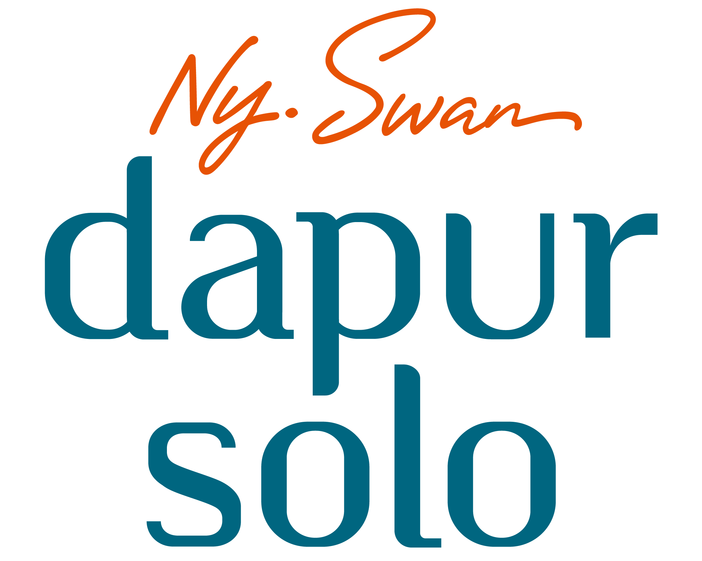

<a name="readme-top"></a>
<!-- PROJECT LOGO -->
<br />
<div align="center">
  <a href="https://github.com/Ikhor03/Dapur-Solo-BE.git">
    
  </a>

<h3 align="center">Dapur Solo</h3>

  <p align="center">
    <br />
    <a href="https://youtu.be/V0d6w4pyTxk"><strong>Video Demo »</strong></a>
    <br />
    <a href="https://dapur-solo.vercel.app/">Web Demo (need to run this API in local)</a>
  </p>
</div>

<!-- ABOUT THE PROJECT -->

[![Product Name Screen Shot][product-screenshot]](https://vercel.com/ikhor03/dapur-solo)

This project is a server side from [Dapur Solo project](https://github.com/Ikhor03/Dapur-Solo-FE.git). I worked on this project to fulfill the back-end task for the bothcamp program by [Eduwork](https://eduwork.id/) that I participated in. The application will run by default on port 3000 at ["localhost:3000"](http://127.0.0.1:3000).

<p align="right">(<a href="#readme-top">back to top</a>)</p>

### Built With

* [Mongoose](https://mongoosejs.com/)
* [Express](https://expressjs.com/)
* [bcrypt](https://www.npmjs.com/package/bcrypt)

<p align="right">(<a href="#readme-top">back to top</a>)</p>

<!-- GETTING STARTED -->
## Getting Started

You can fork this repo

### Installation

1. Clone the repo
   ```sh
   git clone https://github.com/Ikhor03/Dapur-Solo-BE.git
   ```
2. Install and use the correct version of Node using [NVM](https://github.com/nvm-sh/nvm)
   ```sh
   nvm install
   ```
3. Start the development server

   ```sh
   npm run dev
   ```

<p align="right">(<a href="#readme-top">back to top</a>)</p>

<!-- MARKDOWN LINKS & IMAGES -->
<!-- https://www.markdownguide.org/basic-syntax/#reference-style-links -->
[product-screenshot]: public/images/static/ss.png
[React.js]: https://img.shields.io/badge/React-20232A?style=for-the-badge&logo=react&logoColor=61DAFB
[React-url]: https://reactjs.org/
